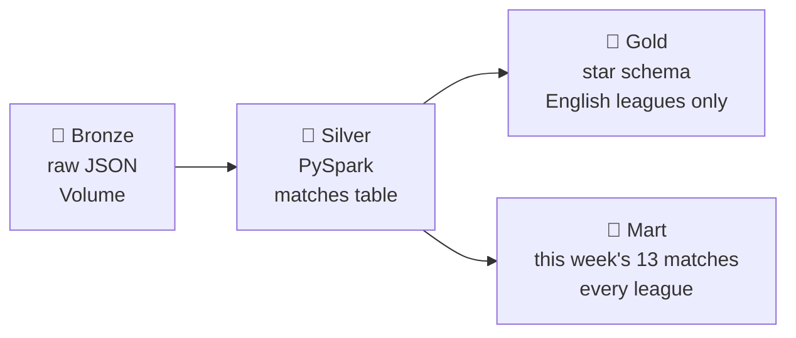
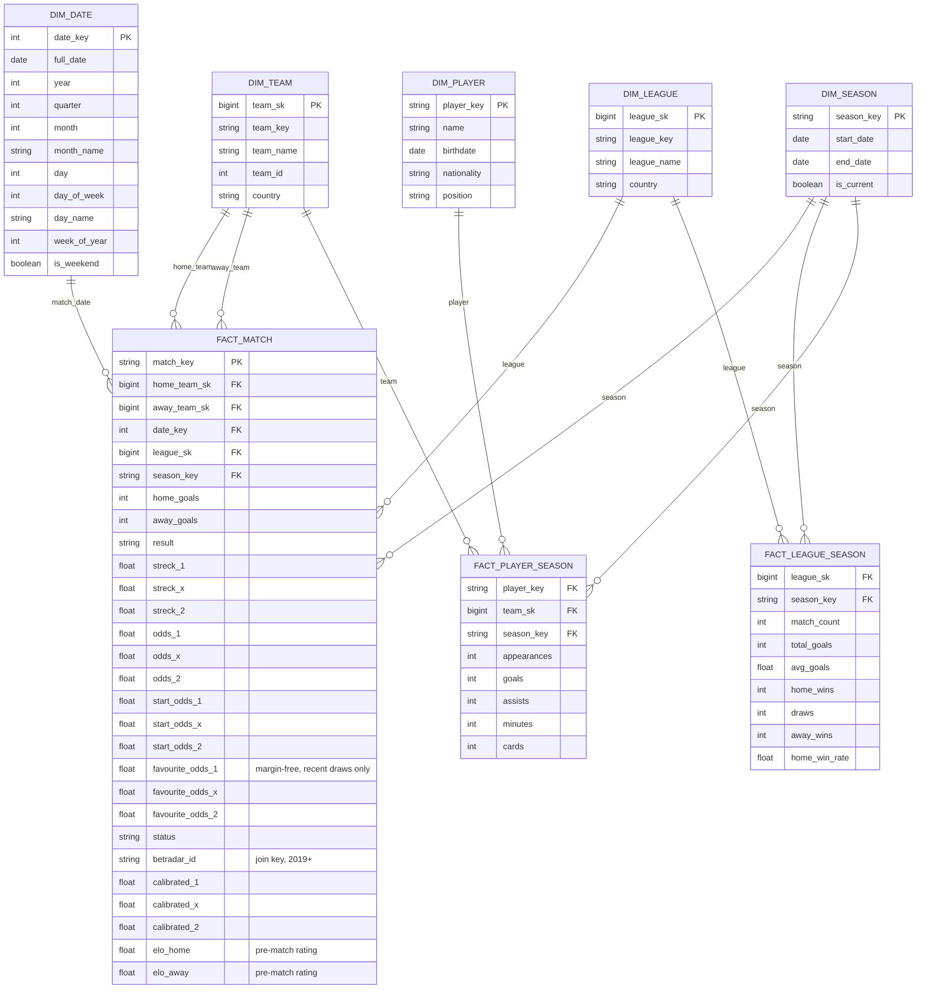

# 🥉🥈🥇 Stryktipset — Databricks Edition

> PySpark + Delta Lake rebuild of the Stryktipset prediction pipeline, running natively on Databricks Free Edition (Unity Catalog + Jobs).

## Pipeline



## Scoring a coupon

`07_score_coupon` writes one row per match per draw into `mart.coupon`, putting three independent opinions side by side: what the public bet (`streck_*`), the same corrected for the crowd's known biases (`calibrated_*`), and Elo.

```
draw 4972 — 13 matches

#   match                   streck 1/X/2     elo xs   gap
1   England - Spanien       32%/28%/40%      53%       -7%
4   Plymouth - Burton       74%/15%/11%      59%      +23%
9   Newport - Grimsby       22%/26%/52%      56%      -21%
10  Rotherham - Crewe       54%/27%/19%      41%      +27%
```

The `elo xs` column is `elo_expected_score` in the table — an expected *score*, where a draw counts as half a win, not the probability of a home win.

`gap` is where the crowd and the ratings disagree, which is the only place there's anything to learn — agreeing with the crowd tells you nothing you didn't already know. Both sides are *expected scores* (Elo counts a draw as half a win), so the crowd is converted with `streck_1 + streck_x / 2` before comparing; subtracting `streck_1` directly would bake in half the draw probability.

It reads **silver, not gold**, and lives in a **mart** rather than the star. Gold holds English league football; a coupon does not — draw 4972 had two UEFA Nations League fixtures and no Premier League at all. A star schema also records what happened, and these are model outputs, so they get their own layer.

Being denormalised is the point of a mart: team and league names are carried as text, so `SELECT *` reads like a coupon with no join. The surrogate keys are there too, so it can still be joined back to the dimensions. Leagues outside gold resolve to `dim_league`'s Unknown member rather than to a null key.

The table accumulates every week, so these predictions can eventually be joined back to results and scored.

## Gold layer — star schema

`fact_match` covers the **five English tiers only** — Premier League down to National League. Sweden was dropped on 2026-09-29 (see project-context.md). Everything else in the raw data stays in silver and is scored by `07` instead, but never reaches gold.

Facts carry **surrogate keys**, not names: `home_team_sk` rather than `ARSENAL`. Rename a team and only the dimension changes, instead of orphaning every historical fact row. The keys are hashes of the business key rather than a counter, because these tables are rebuilt from scratch every run and a counter would hand out different numbers each time. `date_key` and `season_key` stay readable, which is the usual exception for date-like dimensions.

`elo_home`/`elo_away` hold each team's rating **as it stood before kick-off**, computed by `06` — pre-match, so it can be used as a predictor without leaking the result. The ratings themselves are built from *every* match in silver, not just the scoped ones, so a Norwegian or Spanish side on the coupon still has a rating.

xG has no column: no free source covers the lower English tiers.



## Notebooks

| # | Notebook | Layer | Purpose | Status |
|---|---|---|---|---|
| 00 | `setup_catalog_schemas` | — | one-time: catalog, schemas, volume | ✅ |
| 01 | `bronze_ingest` | 🥉 | fetch new draws from Svenska Spel's API | ✅ |
| 02 | `silver_transform` | 🥈 | flatten & clean into `matches` | ✅ |
| 03 | `gold_dimensions` | 🥇 | build `dim_team` / `dim_date` / `dim_league` / `dim_season` | ✅ |
| 04 | `gold_fact_match` | 🥇 | join dims, derive keys, goals & odds → `fact_match` | ✅ |
| 05 | `gold_calibrate` | 🥇 | isotonic fit, MLflow log, merged into `fact_match` | ✅ |
| 06 | `gold_elo` | 🥇 | pre-match Elo ratings, merged into `fact_match` | ✅ |
| 07 | `score_coupon` | 🎯 | score the open coupon into `mart.coupon` | ✅ |
| 08 | `gold_fact_player_season` | 🥇 | player stats (stretch goal) | ⬜ |

`01`–`07` chain into one Databricks Job, which reads the notebooks **from GitHub** (`main`) rather than from the Databricks Git folder — so only committed and pushed code ever runs on the schedule. `00` is one-time setup and isn't a task in the Job. `07` scores the open coupon into `mart.coupon`. `08` waits until player-stats sourcing is worked out.

## Code layout

Transform functions live in `transforms/` (`silver.py`, `dimensions.py`, `fact_match.py`, `fact_league_season.py`, `calibration.py`, `elo.py`, `scoring.py`), not inline in the notebooks — notebooks `02`–`07` just import from there and orchestrate (read tables, call the transform, write the result). This keeps the actual logic importable and testable with plain `pytest` (see `tests/`).

`pytest` runs from inside a Databricks notebook (`%pip install pytest` in its own cell, then `pytest.main(["tests"])` in the next) — Free Edition is serverless-only, so there's no local Spark to spin up for tests; `tests/conftest.py`'s `spark` fixture reuses whichever Spark Connect session the notebook already has.
Locally, the suite runs in **WSL (Ubuntu)**, not on Windows — PySpark's JVM can't open a loopback pipe on this machine. One-time setup inside WSL, no sudo needed (`uv` and a Temurin JDK 17 both install into `~`):

```bash
uv venv ~/venvs/stryktipset --python 3.12
uv pip install --python ~/venvs/stryktipset/bin/python -r requirements-dev.txt
```

After that, `./run-tests.sh` from WSL runs all 17 tests in about 40 seconds. Local Spark is *classic* Spark, not the Spark Connect session Free Edition gives you, so it's a fast inner loop on `transforms/` — not a replacement for running the suite in a notebook before trusting a pipeline change.

Test coverage so far: `transforms/silver.py` and `transforms/dimensions.py` are fully tested; `transforms/calibration.py`'s deterministic pieces are tested (the statistical fit itself is checked for shape — non-decreasing, stays in [0, 1] — not exact values); `transforms/fact_match.py` is tested too — scoping drop-out, the derived keys, the three season-key shapes, and the null `calibrated_*`/`elo_*` placeholders. `transforms/elo.py` covers the rating curve, and that ratings come back pre-match, zero-sum, and that an unplayed fixture is rated without teaching the ratings anything. `transforms/scoring.py` covers draw selection, a match with no Elo staying visible rather than being dropped, an out-of-scope league resolving to the Unknown member, and that its column-expression copy of the Elo formula agrees with the float one. `transforms/fact_league_season.py` covers the aggregation and that unplayed fixtures are excluded from every rate.

One test is **skipped**: `test_build_dim_team_scd2`, against a deliberate `NotImplementedError` stub. `dim_team` is currently a Type 1 slowly changing dimension — the newest row wins and history is overwritten — and the stub documents what Type 2 would take.

## Stack

Databricks Free Edition · PySpark · Delta Lake · Unity Catalog · Databricks Jobs · MLflow

## Why this exists

Replaces the local Docker + Airflow version of this pipeline — same domain, same medallion shape, rebuilt cloud-native: Delta tables instead of local files, Databricks Jobs instead of Airflow, a proper star schema instead of a flat CSV.
