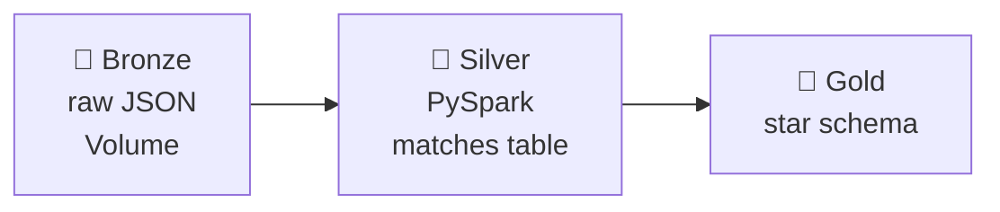
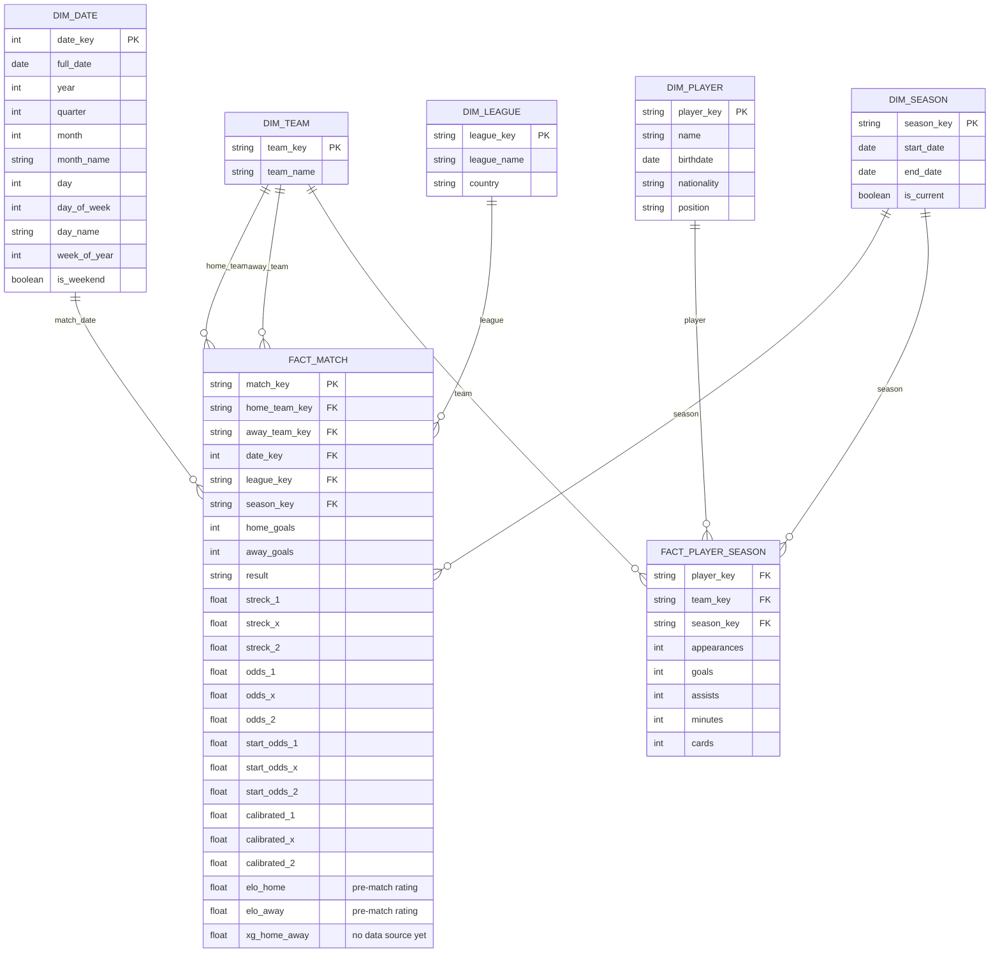

# 🥉🥈🥇 Stryktipset — Databricks Edition

> PySpark + Delta Lake rebuild of the Stryktipset prediction pipeline, running natively on Databricks Free Edition (Unity Catalog + Jobs).

## Pipeline



## Gold layer — star schema

`fact_match` is scoped to English and Swedish domestic leagues only (see project-context.md) — everything else in the raw data (cups, European competitions, national teams, other countries) stays in silver but never reaches gold. `elo_home`/`elo_away` hold each team's rating **as it stood before kick-off**, computed by `06` — a pre-match value, so it can be used as a predictor without leaking the result. `xg_home_away` is still in the schema but unpopulated: no confirmed free data source covers these leagues.



## Notebooks

| # | Notebook | Layer | Purpose | Status |
|---|---|---|---|---|
| 00 | `setup_catalog_schemas` | — | one-time: catalog, schemas, volume | ✅ |
| 01 | `bronze_ingest` | 🥉 | fetch new draws from Svenska Spel's API | ✅ |
| 02 | `silver_transform` | 🥈 | flatten & clean into `matches` | ✅ |
| 03 | `gold_dimensions` | 🥇 | build `dim_team` / `dim_date` / `dim_league` / `dim_season` | ✅ |
| 04 | `gold_fact_match` | 🥇 | join dims, derive keys, goals & odds → `fact_match` | ✅ |
| 05 | `gold_add_calibration` | 🥇 | isotonic fit, MLflow log, merged into `fact_match` | ✅ |
| 06 | `gold_elo` | 🥇 | pre-match Elo ratings, merged into `fact_match` | ✅ |
| 07 | `gold_fact_player_season` | 🥇 | player stats (stretch goal) | ⬜ |

`01`–`06` chain into one Databricks Job, which reads the notebooks **from GitHub** (`main`) rather than from the Databricks Git folder — so only committed and pushed code ever runs on the schedule. `00` is one-time setup and isn't a task in the Job. `07` waits until player-stats sourcing is worked out.

## Code layout

Gold-layer transform functions live in `transforms/` (`silver.py`, `dimensions.py`, `fact_match.py`, `calibration.py`), not inline in the notebooks — notebooks `02`–`05` just import from there and orchestrate (read tables, call the transform, write the result). This keeps the actual logic importable and testable with plain `pytest` (see `tests/`).

`pytest` runs from inside a Databricks notebook (`%pip install pytest` in its own cell, then `pytest.main(["tests"])` in the next) — Free Edition is serverless-only, so there's no local Spark to spin up for tests; `tests/conftest.py`'s `spark` fixture reuses whichever Spark Connect session the notebook already has.
Locally, the suite runs in **WSL (Ubuntu)**, not on Windows — PySpark's JVM can't open a loopback pipe on this machine. One-time setup inside WSL, no sudo needed (`uv` and a Temurin JDK 17 both install into `~`):

```bash
uv venv ~/venvs/stryktipset --python 3.12
uv pip install --python ~/venvs/stryktipset/bin/python -r requirements-dev.txt
```

After that, `./run-tests.sh` from WSL runs all 11 tests in about 40 seconds. Local Spark is *classic* Spark, not the Spark Connect session Free Edition gives you, so it's a fast inner loop on `transforms/` — not a replacement for running the suite in a notebook before trusting a pipeline change.

Test coverage so far: `transforms/silver.py` and `transforms/dimensions.py` are fully tested; `transforms/calibration.py`'s deterministic pieces are tested (the statistical fit itself is checked for shape — non-decreasing, stays in [0, 1] — not exact values); `transforms/fact_match.py` is tested too — scoping drop-out, the derived keys, the three season-key shapes, and the null `calibrated_*`/`elo_*` placeholders. `transforms/elo.py` is tested too — the rating curve itself, and that ratings come back pre-match and zero-sum.

## Stack

Databricks Free Edition · PySpark · Delta Lake · Unity Catalog · Databricks Jobs · MLflow

## Why this exists

Replaces the local Docker + Airflow version of this pipeline — same domain, same medallion shape, rebuilt cloud-native: Delta tables instead of local files, Databricks Jobs instead of Airflow, a proper star schema instead of a flat CSV.
