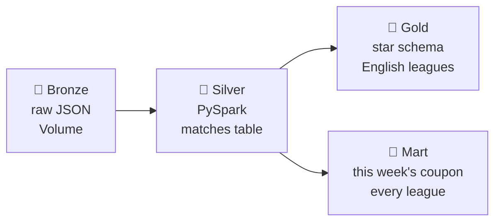
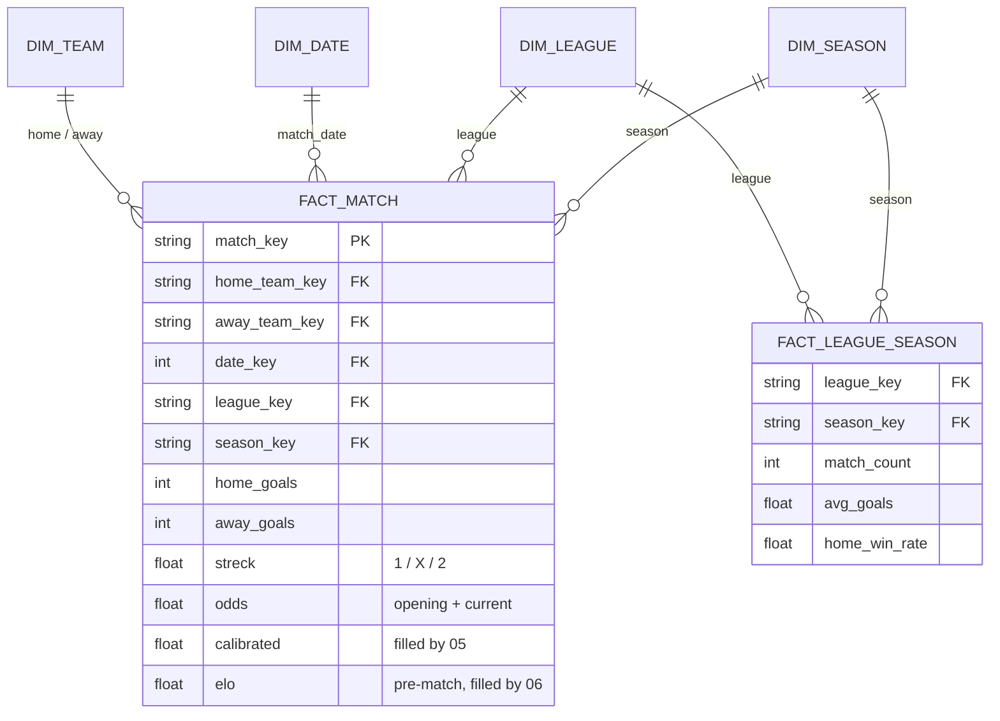

# 🥉🥈🥇 Stryktipset — Databricks Edition

> PySpark + Delta Lake pipeline that scores the week's Stryktipset coupon, running natively on Databricks Free Edition (Unity Catalog + Jobs).

Every Saturday it fetches the open draw, rebuilds the warehouse, and writes 13 scored matches — three independent opinions per match, side by side.

## Pipeline



## What it produces

`mart.coupon`, one row per match per draw:

```
draw 4972 — 13 matches

#   match                   streck 1/X/2     elo xs   gap
1   England - Spanien       23%/29%/48%      53%      -15%
4   Plymouth - Burton       76%/15%/9%       59%      +25%
9   Newport - Grimsby       15%/26%/59%      56%      -28%
10  Rotherham - Crewe       54%/27%/19%      41%      +27%
```

- **`streck`** — what the Swedish public actually bet
- **`calibrated`** — the same, corrected for the crowd's known biases (isotonic regression, notebook `05`)
- **`elo xs`** — your own rating, built from results alone (notebook `06`)
- **`gap`** — where the crowd and the ratings disagree. Measured, and mostly Elo being wrong: see project-context.md

The mart reads **silver, not gold**: gold holds English league football, and a coupon doesn't — draw 4972 had two Nations League fixtures and no Premier League at all. See `project-context.md` for why `gap` needs converting first, and why this lives outside the star.

## Does it work?

Measured on matches the models had never seen, on the five English tiers only: fitted on the 4,611 matches before July 2023, scored on the 1,505 since. Lower is better.

| | Brier | |
|---|---|---|
| knowing nothing (33/33/33) | 0.2222 | |
| raw `streck` | 0.2096 | the crowd's own edge |
| **calibrated crowd** | **0.2066** | **+0.0029, t = 3.08 — real** |
| elo alone | 0.2118 | genuine signal, weaker than the market |
| crowd + elo, best combination | 0.2063 | +0.0003, t = 1.84 — not significant |

**Calibrating the crowd works.** It beats raw `streck` by about 23% of the crowd's own edge over knowing nothing — small, but statistically solid, and it holds at every cutoff tried.

**Elo doesn't clearly add to it.** Four ways of combining them — an equal blend, a fitted-weight blend, a logistic pool in log-odds space, and a pool with an interaction term testing whether Elo helps specifically where the market is unsure — none beat the crowd at the 95% level. The best of them gets close here, but the gap moves around when the cutoff moves, which is the honest limit of a single split. Elo knows real things about team strength; the market has mostly priced them in.

`backtest.ipynb` reproduces all of it. The reasoning, the caveats, and one instructive trap about reading coefficients are in `project-context.md`.

## Data model

Gold covers the **five English tiers** — Premier League down to National League. Two facts sharing conformed dimensions.



`elo_home`/`elo_away` are each team's rating **before kick-off**, so they can be used as a predictor without leaking the result — though the ratings themselves are built from *every* match in silver, so a Norwegian or Spanish side on the coupon still has one.

Full column lists, the key decisions and their trade-offs are in `project-context.md`.

## Notebooks

| # | Notebook | Layer | Purpose | Status |
|---|---|---|---|---|
| 00 | `setup_catalog_schemas` | — | one-time: catalog, schemas, volume | ✅ |
| 01 | `bronze_ingest` | 🥉 | fetch new draws from Svenska Spel's API | ✅ |
| 02 | `silver_transform` | 🥈 | flatten & clean into `matches` | ✅ |
| 03 | `gold_dimensions` | 🥇 | `dim_team` / `dim_date` / `dim_league` / `dim_season` | ✅ |
| 04 | `gold_fact_match` | 🥇 | `fact_match` + `fact_league_season` | ✅ |
| 05 | `gold_calibrate` | 🥇 | isotonic fit, MLflow log, merged into `fact_match` | ✅ |
| 06 | `gold_elo` | 🥇 | pre-match Elo ratings, merged into `fact_match` | ✅ |
| 07 | `score_coupon` | 🎯 | score the open coupon into `mart.coupon` | ✅ |
| 08 | `gold_fact_player_season` | 🥇 | player stats (stretch goal) | ⬜ |

`01`–`07` chain into one Databricks Job, Saturdays 15:00, reading the notebooks **from GitHub** rather than from the Databricks Git folder — so only committed and pushed code ever runs on a schedule.

`backtest.ipynb` is unnumbered because it isn't part of that chain: it is run by hand, writes nothing, and produces the table above.

## Code layout

Transform functions live in `transforms/`, not inline in the notebooks, so they're importable and testable with plain `pytest`. The notebooks stay thin: imports, table names, and a `main()` that reads, transforms and writes.

```bash
./run-tests.sh        # from a WSL terminal — 26 tests, ~50s
```

Local Spark is *classic* Spark; Databricks Free Edition is serverless Spark Connect. So the local suite is a fast inner loop on `transforms/`, not a substitute for running it in a notebook before trusting a pipeline change. One-time setup and the reason it can't run on Windows are in `project-context.md`.

## Stack

Databricks Free Edition · PySpark · Delta Lake · Unity Catalog · Databricks Jobs · MLflow

## Why this exists

Replaces the local Docker + Airflow version of this pipeline — same domain, same medallion shape, rebuilt cloud-native: Delta tables instead of local files, Databricks Jobs instead of Airflow, a proper star schema instead of a flat CSV.
