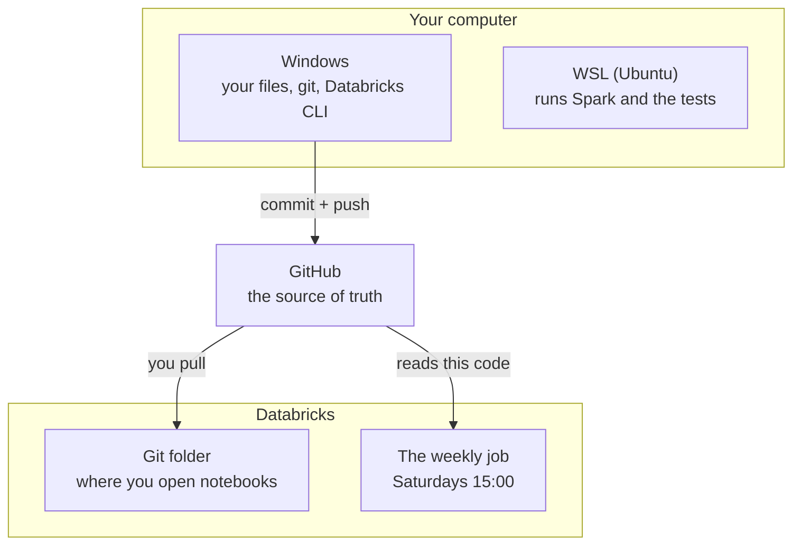

# Stryktipset — Databricks Rebuild: Project Context

## What this is
A PySpark + Delta Lake rebuild of an existing local Stryktipset (Swedish football pool) pipeline, running natively on Databricks Free Edition. This is a new, separate build — not a port of the old repo's files.

## Original project (reference only, not reused)
`stryktipset-projekt`: local Python pipeline, medallion architecture (bronze/silver/gold), Docker + Airflow, sklearn isotonic-regression calibration. Left untouched as its own working project.

## Architecture decisions
- Unity Catalog: catalog `stryktipset`, schemas `bronze` / `silver` / `gold`
- Bronze: plain Python (`requests`) ingestion from Svenska Spel's API, raw JSON landed as files in a Volume (`stryktipset.bronze.raw_draws`) — deliberately kept as inspectable files, not a Delta table
- Silver: PySpark — flattens/cleans bronze JSON into a `matches` Delta table. Stays complete and unfiltered (every league, every country, cups, internationals, national teams) — this is what lets calibration (`05`) train on the full historical dataset even though gold is scoped narrower. One row per `match_id` is enforced here (see gotchas below).
- Gold: PySpark — a proper star schema, replacing the original's flat CSV
- Calibrated probability is a column on `fact_match`, not a separate table (decided explicitly)
- **Scope: `fact_match` only covers English and Swedish domestic leagues.** `dim_league` is built from a curated `LEAGUE_COUNTRY` name→country lookup (only the leagues you explicitly list); `04_gold_fact_match` filters `matches` down to that same set before building fact rows. Everything else — cups, Champions League, national teams, other countries — is simply excluded, not nulled out. Silver is untouched by this; only gold is scoped.
- `dim_league.country` comes from the curated lookup, not derived from team data — an earlier idea (derive league country from the countries of teams that played in it) was considered and dropped as unnecessary complexity once the direct lookup proved simpler.
- `dim_team` has `team_key`, `team_name`, `team_id` and `country`. It still deliberately has **no** `league` column: league isn't a stable team attribute — teams get promoted and relegated between tiers, so it's a property of a match (`fact_match.league_key`), not of the team.
  - **`country` reverses an earlier decision** to leave it out. That call was made when country looked like something to derive from team data; a field-by-field dump of bronze on 2026-09-24 showed `participants[].countryName` is supplied directly by Svenska Spel for every draw back to 2013, so it costs nothing.
  - `team_id` is the "external team ID" this table was always meant to hold — though it's Svenska Spel's own, not football-data.org's. **It is not stable across the full history:** they have renumbered at least once (`1000041` in 2013, `448` by 2023, `69` by 2026). `build_dim_team` therefore dedupes with a `row_number()` window taking the newest row per team, not `dropDuplicates`, so a team gets its current id rather than an arbitrary historical one.
  - `team_key` stays the uppercased `team_name`. It's what `fact_match` joins on, and moving the key to `team_id` would ripple through the fact table for no gain given the renumbering above.
- `dim_date` is a full calendar — every calendar day, not just dates that had matches — spanning from the earliest match in the data to two years past today, so future draws are already covered. `day_of_week` uses the ISO convention (Monday=1..Sunday=7), computed via `F.dayofweek()` (Spark's Sunday-first result) remapped with a `when/otherwise`, not `date_format(..., "u")` — that pattern letter isn't recognized by Spark 3.0+'s `DateTimeFormatter` and throws `INCONSISTENT_BEHAVIOR_CROSS_VERSION_DATETIME_PATTERN_RECOGNITION`. No `matchday` column — that's `fact_match.draw_number`, not a calendar attribute.
- `dim_season` covers both England and Sweden, but the two countries' seasons don't share a shape, so `season_key`/`start_date`/`end_date` are computed differently per country rather than with one global rule: England seasons span two calendar years (Aug–May, July cutoff decides the year pair, key like `"2024/2025"`); Sweden seasons sit inside one calendar year (key is just `"2024"`, Jan 1–Dec 31). `build_dim_season` requires its input already joined against `LEAGUE_COUNTRY` (adds a `country` column) and filtered to non-null `country` first — matches from leagues outside the England/Sweden scope must not reach this function, or they'd fall into the Sweden-shaped branch by default. `season_label` was dropped as redundant with `season_key`; `start_date`/`end_date`/`is_current` were added instead, since those carry actual information `season_key` alone doesn't.
- **`04_gold_fact_match` design:** joins `matches` to the already-built `dim_league` table (not a re-imported `LEAGUE_COUNTRY` dict — avoids having the England/Sweden league list live in two places) via `matches['league'] == dim_league['league_name']`; that inner join both scopes to England/Sweden and supplies `league_key`/`country`. `team_key`/`date_key` are derived directly from existing columns (pure functions — `upper(team_name)`, formatted `match_start`), no join needed for those. `season_key` reuses the same per-country logic as `build_dim_season`, computed inline (not by calling `build_dim_season` itself, since that function collapses to one row per season — here every match row needs to keep its own `season_key`).
- **`fact_match`'s real primary key is `match_key`, copied directly from silver's `match_id`** (`withColumn('match_key', F.col('match_id'))`) — resolves the gap flagged when `05` was first written. `match_id` itself is *not* carried onto `fact_match` (not in `04`'s final `.select(...)`), so anything joining against `fact_match` on the match grain must use `match_key`.
- `fact_match` carries odds and calibration as separate per-outcome columns (`odds_1`/`odds_x`/`odds_2`, `start_odds_1`/`x`/`2`, `calibrated_1`/`x`/`2`), not single combined fields — matches the shape `streck_1`/`streck_x`/`streck_2` already uses in silver.
- **`calibrated_1`/`calibrated_x`/`calibrated_2` are created as null placeholder columns by `04` itself**, not left absent for `05` to add. Reason: Delta's `MERGE` schema evolution (`WITH SCHEMA EVOLUTION` or the classic autoMerge config) only auto-adds new columns for the wildcard forms (`UPDATE SET *` / `INSERT *`) — an explicit assignment like `target.calibrated_1 = source.calibrated_1` fails with `DELTA_MERGE_UNRESOLVED_EXPRESSION` if that column doesn't already exist on target, since Spark tries to resolve it before any evolution logic runs. Pre-creating the columns as null in `04` sidesteps this; `05`'s merge stays a plain, explicit-column `MERGE INTO` (schema evolution not actually needed once the columns already exist).
- **Elo (`06_gold_elo`)** is the first feature in `fact_match` that isn't derived from the betting market — `streck_*` and `odds_*` are both other people's opinions, so a disagreement between Elo and the odds carries information. Decisions:
  - `elo_home`/`elo_away` are the ratings **before kick-off**, never after. Storing the post-match rating would leak the result into the feature; a model trained on it would look excellent and predict nothing.
  - Parameters live as constants in `transforms/elo.py`: `INITIAL_RATING = 1500`, `K_FACTOR = 20`, `HOME_ADVANTAGE = 65` (added to the home rating when computing the expectation, so the stored rating stays venue-independent).
  - **One pool across every tier and every country** — never a separate Elo per league, which would force each division to average 1500 and make promotion meaningless. One pool lets a relegated team carry its rating down, which is correct.
  - **The pool was widened on 2026-09-25, reversing the "gold scope only" decision taken the day before.** `06` no longer joins `dim_league`; it rates every match in silver. The reason is `07`: about 16% of coupon matches are outside gold's England/Sweden scope (measured over 117 matches sampled from nine draws 2013–2026 — Eliteserien, Scottish Premiership, La Liga, Serie A, Superligaen, Champions League, U21 internationals), roughly 2 per coupon, and a scorer that silently covered 11 of 13 would be worse than useless. Cups and European ties now feed the ratings too, which incidentally links the divisions onto a more comparable scale. Gold's star schema is unchanged and still England/Sweden only.
  - No season handling: one chronological pass, no reset and no regression toward the mean. A reset would discard everything known each August; regression is the milder version and can be added later as a single constant and measured.
  - Recomputed in full every run — Elo is sequential, so there's no incremental shortcut that stays correct when history is backfilled.
  - Verified on real data 2026-09-24 with the narrow pool: 7,614 rated matches, the ten highest pre-match home ratings all Manchester City or Liverpool. Re-verified 2026-09-25 after widening: **9,174 matches**, range 1329.9–1811.6, mean 1507.1, Liverpool on top.
- Elo and xG follow the same pattern as calibration (computed elsewhere, merged onto existing `fact_match` rows). Elo needs its own notebook rather than fitting into `04` because it's sequential -- each match's rating depends on both teams' full history in order, not a per-row column expression. xG isn't built.
- Compute: Free Edition is serverless-only, capped at 5 concurrent job tasks account-wide — irrelevant here since the pipeline runs as one linear chain
- Scheduling: one Databricks Job chaining notebooks `01`–`07` (`00` is one-time setup, not a task), cron on the Job itself — Saturdays 15:00 Europe/Stockholm, replacing Airflow entirely for this version
- **The Job reads code from GitHub, not from the workspace** (changed 2026-09-23). Each task uses `git_source` (`main` on `github.com/adamwillner/stryktipset-project-databricks`) with `source: GIT` and repo-relative notebook paths, instead of `source: WORKSPACE` pointing at `/Workspace/Users/.../<notebook>`. Reason: under WORKSPACE source the Job runs whatever sits in the Git folder *at that moment*, so an uncommitted experiment left in a notebook would run on the schedule. Under GIT source only committed-and-pushed code runs — the trade-off being that an edit has no effect until it is pushed. Verified 2026-09-24 by a manual run: all five tasks reported `source: GIT`, SUCCESS in 300s — so the extensionless repo-relative path (`01_bronze_ingest`) is the right spelling, and `from transforms import ...` resolves against the checkout.
- **The MLflow experiment is pinned to a workspace path** — `MLFLOW_EXPERIMENT` in `05`, with `mlflow.set_experiment(...)` before `start_run`. Required by the change above: notebook-attached experiments created by a Job whose source is a *remote Git repo* are written to temporary storage and risk deletion in Databricks' scheduled cleanup (stated in the Git folder limits docs). A named workspace experiment is permanent, and also survives notebook renames and branch switches. Runs logged before this change stay in the old notebook experiment — they don't migrate.

## Code organization
Gold-layer transform functions (`build_dim_team`, `build_dim_date`, `build_dim_league`, `build_dim_season`, `build_fact_match`, the calibration functions, plus silver's `parse_swedish_decimal`/`extract_match_row`) live in a `transforms/` package (`transforms/silver.py`, `dimensions.py`, `fact_match.py`, `calibration.py`), not inline in the notebooks. Notebooks `02`–`05` now just import from `transforms` and stay thin — imports, table-name constants, and a `main()` that reads tables, calls the transform function(s), and writes the result. Reason: a function defined directly in a notebook cell can't be imported by `pytest` (no way to import a numbered `.ipynb` file, and no local-Spark test environment on that path anyway), so anything worth unit testing has to live in a plain importable `.py` module instead.
- **`spark`-global gotcha found while extracting `build_dim_date`/`build_dim_league`:** both referenced a bare `spark` name, which works fine inline in a notebook cell (Databricks injects `spark` into the notebook's own global namespace) but breaks with `NameError` once the function moves into an imported module — a function's globals resolve from its *defining* module, not the caller's. `build_dim_date` already takes a `df` argument, so it derives the session via `df.sparkSession` instead of the bare name. `build_dim_league` originally had no DataFrame to derive one from, so it briefly took `spark: SparkSession` as an explicit parameter — but since `LEAGUE_COUNTRY` is just a static dict with no dependency on other Spark data, the cleaner fix was to move `spark.createDataFrame(...)` into `03`'s `main()` itself (which already has `spark`) and have `build_dim_league(df)` take a plain DataFrame, same shape as every other `build_dim_*` function. `main()` now does `league_df = spark.createDataFrame(list(LEAGUE_COUNTRY.items()), ['league_name', 'country'])` then `build_dim_league(league_df)`. Worth remembering the general lesson (a moved function can't see the notebook's `spark`) even though this specific function no longer needs either workaround.

## Repo topology

Three copies, all normally on the same commit:

| copy | role |
|---|---|
| Databricks Git folder — `/Users/adamwillner2@gmail.com/stryktipset-project-databricks` | where notebooks are edited and committed through the Databricks UI |
| local clone — `C:\Users\AdamWillner\stryktipset-project-databricks` | docs, `transforms/`, `tests/`; what Cowork and Claude Code work against |
| GitHub — `adamwillner/stryktipset-project-databricks` | the hub the other two sync through, and — since the Job uses `git_source` — what actually runs |

The `databricks` CLI is set up with a `free` profile (`databricks configure --profile free`, host `https://dbc-2e6f09e7-192b.cloud.databricks.com`, personal access token scoped to `workspace`/`files`/`jobs`). It's for inspecting jobs and runs — not for moving code.

**Code moves through git only:** edit locally, commit, push, then Pull in the Databricks Git folder. `databricks sync --watch` can mirror the local clone into the folder live and was tried on 2026-09-23, but was deliberately dropped: it writes files behind git's back, so every local edit then shows as uncommitted changes in the Git folder — which have to be discarded, not committed (committing them would duplicate commits already on GitHub). Little upside now that the Job reads GitHub rather than the folder; all it saved was a click on Pull.

## Bronze fields and their coverage
`02` originally extracted 8 of the ~60 fields in each event. These were added on 2026-09-24, and their history varies a lot — checked by sampling draws 4300 (2013), 4600 (2019), 4700, 4800, 4870, 4900, 4930, 4950 and 4971 (2026):

| field(s) | available since | note |
|---|---|---|
| `home/away_team_country`, `status` | all of it (2013+) | `countryName`, `sportEventStatus` |
| `home/away_team_id`, `league_id` | all of it, **but renumbered** | see the `dim_team` note above |
| `betradar_id` | ~2019 | `providerIds` is empty in the 2013 draws; BetRadar is not always element 0, so it's selected by provider name |
| `favourite_odds_1/x/2` | **newest draws only** | present in 4971, absent in 4950 (April 2026) |

`favourite_odds_*` is Svenska Spel's own implied probability with the bookmaker's margin removed — the raw odds imply ~103%, these sum to exactly 100 (1.66/3.95/5.75 → 58.52/24.59/16.89). Stored divided by 100 so it sits on the same 0–1 scale as `streck_*`. It is the most useful of the new fields **and has almost no history**, so it can't be trained on yet; it's captured now so history accumulates.

`league_id` is carried in silver but not used in gold: `dim_league` is built from the curated `LEAGUE_COUNTRY` dict, which defines gold's *scope*, and has no match data to join an id against.

## Testing
`tests/` mirrors `transforms/`, one `test_*.py` per module, plus `tests/conftest.py` holding a shared `spark` pytest fixture. As of today: `transforms/silver.py` and `transforms/dimensions.py` are fully tested; `transforms/calibration.py`'s deterministic pieces (`to_long_format`, `calibrate_matches`, `evaluate_calibration`) are tested, plus a shape/sanity test for `fit_calibration_curve` (non-decreasing output, stays in [0, 1] — a statistical fit can't be asserted to an exact value); `transforms/fact_match.py` is covered by a single `test_build_fact_match` (one test per function, matching the other modules): an out-of-scope league dropping out of the inner join, the derived `match_key`/team/date/league keys, the three season-key shapes (England Aug, England Mar, Sweden), and `calibrated_1/x/2` arriving as null doubles rather than missing columns. `transforms/elo.py` has `test_expected_home_score` (the curve, including that home advantage makes equal ratings favour the home side) and `test_build_elo` (first-ever match reports exactly 1500, proving ratings are pre-match; gains and losses are equal and opposite; an unplayed fixture never reaches the ratings). Three testing-specific gotchas worth knowing (how `pytest` runs on serverless, building nested fake data, `.collect()` row order) are folded into the gotchas list below rather than repeated here.

## Scoring an upcoming coupon
`07_score_coupon` reads **silver**, not gold, and writes `stryktipset.gold.coupon_predictions` — one row per match per draw, MERGEd on `match_id` so re-running through the week updates in place rather than duplicating (streck keeps moving until the draw closes).

It reads silver because gold is scoped and a coupon is not. Calibration needs only `streck`, so it covers all 13 matches regardless of league; Elo covers them because the pool was widened (above).

Three opinions per match end up side by side: `streck_*` (what the public bet), `calibrated_*` (the same corrected for the crowd's known biases), and `elo_expected_score`. **`elo_expected_score` is P(home win) on Elo's chess-shaped scale, where a draw counts as half a win — it is not a 1X2 probability** and must not be read as one. Turning it into three outcomes is a separate problem.

The predictions table accumulates, which is the point: in a few months it can be joined back to results and scored, turning "am I better than the crowd?" from an opinion into a measurement.

Two ingest changes were needed to make any of this possible:
- `01` looped `range(4267, get_latest_draw_number())`, and `range` excludes its upper bound — so **the open draw was never fetched**. Now `+ 1`.
- `draw_already_saved()` meant a draw was never re-fetched, so a coupon saved while open would be frozen with no results and stale streck. `REFRESH_WINDOW = 2` re-fetches the newest draws and skips settled ones.
- `02` no longer filters out matches with no result, so silver is genuinely complete. `status` consequently stops being a constant.

## Star schema (gold layer)
Two fact tables sharing dimensions:
- `fact_match` — one row per match, **English/Swedish domestic leagues only** (see scope decision above). Dimensions: `dim_team` (role-playing: home + away), `dim_date`, `dim_league`, `dim_season`. Measures: goals, odds (`odds_1/x/2`, `start_odds_1/x/2`), `calibrated_1/x/2`, `elo_home`/`elo_away` (pre-match, built by `06`), xG (nullable, not sourced).
- `fact_player_season` — one row per player per season (stretch goal, notebook `07`). Dimensions: `dim_player`, `dim_team`, `dim_season`. Measures: appearances, goals, assists, minutes, cards.
- `dim_player` holds only slowly-changing bio fields (name, birthdate, nationality, position) — stats belong in the fact table, not the dimension.
- Possible future addition (not started): a second small fact table, `fact_league_season` (one row per league+season, holding aggregated `match_count`/`total_goals`), sitting alongside `fact_match` and sharing `dim_league`/`dim_season` — a fact constellation, not a change to either dimension. Considered if per-league season stats become useful; `dim_league`/`dim_season` themselves would stay flat, unchanged.

## Notebooks (chain into one Databricks Job)
| # | Notebook | Purpose | Status |
|---|---|---|---|
| 00 | setup_catalog_schemas | one-time SQL: catalog, schemas, volume | done |
| 01 | bronze_ingest | fetch new draws from Svenska Spel's API | done |
| 02 | silver_transform | PySpark flatten into `matches` | done |
| 03 | gold_dimensions | build dim_team/date/league/season | done |
| 04 | gold_fact_match | join dims, derive keys, goals & odds → fact_match | done |
| 05 | gold_add_calibration | isotonic fit, MLflow log, merge into fact_match | done |
| 06 | gold_elo | pre-match Elo ratings, merged into fact_match | done |
| 07 | score_coupon | score the open coupon into coupon_predictions | done |
| 08 | gold_fact_player_season | player stats (stretch) | not started |

## Known gaps
- Tests: all four `transforms/` modules are now tested (see Testing section above); no CI runs any of this automatically yet — run locally with `./run-tests.sh` from WSL, or via `%pip install pytest` + `pytest.main(["tests"])` in a Databricks notebook. All 13 tests pass locally (WSL) as of 2026-09-24; they have not been run on Databricks' Spark Connect since `test_build_fact_match` was added, and local classic Spark doesn't reproduce the Spark Connect restrictions listed below.
- **Elo is computed on coupon matches only, which is thinner than it looks.** Silver holds only matches that appeared on a Stryktipset coupon — about 13 per weekly draw, 7,614 of them inside the gold leagues — not complete league fixture lists. With so few matches per team the ratings move slowly and the spread stays compressed: the first full run produced a range of 1335–1797, where a complete fixture history would spread wider. Ingesting full results from football-data.org (see Data sourcing notes) is the obvious next improvement to Elo, and would matter more than tuning K.
- The mean of `elo_home` came out at 1505.5 rather than exactly 1500. Elo is zero-sum across *teams*, but this is a mean across *match rows*, so clubs that appear on more coupons — the bigger ones, which are also the higher rated — carry more weight. Expected, not a leak.
- xG has no confirmed free data source covering these leagues (see Data sourcing notes) — column exists on `fact_match`, always null for now.
- **League names are matched as free text, and variants silently drop matches.** The coverage sample turned up `Division 2 Norra Götaland` counted as out of scope while `Div 2, Norra Götaland` is in — the same league written two ways, so `04`'s inner join against `dim_league` discards matches it intends to keep. Fix is to normalise (strip commas, collapse whitespace, casefold) on both sides, or to match on the `league_id` now carried in silver. Left separate from the forward-looking work so its effect on row counts is measurable on its own.

## Data sourcing notes
- Team-level: football-data.org — free, no meaningful cap, fixtures/results/standings.
- Player/team stats: API-Football via RapidAPI — free tier capped at 100 requests/day + 10/minute, resets 00:00 UTC. Budget per team, not per player; only need the ~26 teams on a given week's coupon.
- xG: no free source covers Stryktipset's actual league mix (Understat only covers the Big 5). A custom xG model trained on StatsBomb's free open shot data is viable as a standalone exercise, not for live scoring of most matches on the coupon.

## Gotchas already worked out
- **Elo's number is an expected score, not P(home win) — don't subtract it from `streck_1`.** Elo comes from chess, where a draw counts as half a win, so `elo_expected_score` is really `P(1) + P(X)/2`. Comparing it directly against `streck_1` bakes in roughly half the draw probability and makes the crowd look wrong on nearly every match — which is exactly what the first version of `07`'s gap column did. Convert the crowd to the same scale first: `streck_1 + streck_x / 2`. Turning Elo into a real 1X2 split needs a draw model and is a separate problem.
- **A trailing `.otherwise()` swallows nulls.** `extract_match_row` derived `result` as `when(home > away, '1').when(home == away, 'X').otherwise('2')`. For an unplayed fixture both goal columns are null, so every comparison evaluates to null rather than true and the row fell through to `.otherwise('2')` — labelling it an away win. **It never reached silver**: `02` already filters `home_goals`/`away_goals` non-null before writing, so no invented result was ever stored and `05`'s calibration was never trained on one. Fixed anyway on 2026-09-24, because a transform should be correct on its own rather than relying on a filter in the notebook that calls it: all three branches are now explicit with **no** `.otherwise()`, so `result` is null when nothing matches. `to_long_format` also filters on `result IS NOT NULL`, which is a no-op today but becomes load-bearing the day `02` stops filtering.
- `spark.sql()` runs exactly one statement per call — no `;`-separated multi-statement strings like a SQL notebook cell allows.
- Unity Catalog Volumes support plain Python file I/O directly (`pathlib.Path`, `os`) — `dbutils.fs` isn't required.
- Notebooks don't need `if __name__ == "__main__":` — Databricks doesn't execute files like `python script.py` does, and the numbered filenames (`01_...`) can't be imported as modules anyway. Just call `main()` directly.
- A failure inside a loop (e.g. one draw that didn't fetch) won't fail the notebook/Job unless you explicitly `raise` — otherwise the run reports Success even when something silently broke. Job failure notifications (email/Slack) are a separate setup step on top of the `raise`.
- The `league` column from Svenska Spel's API is much messier than it looks — around 140 distinct values, including casing duplicates (`Damallsvenskan`/`DamAllsvenskan`), spacing duplicates (`La Liga`/`LaLiga`), and inconsistent comma usage for competition groups/qualifiers (some use `"X, Grupp A"`, others `"X Grupp A"` with no comma at all). Don't trust a quick `.show()` of distinct leagues — it truncates by default and hides most of this; use `.collect()` + plain `print()` instead.
- `spark.createDataFrame(some_list_of_tuples, [...])` can fail with `CANNOT_INFER_TYPE_FOR_FIELD` if Spark can't pin down a column's type from the first row (e.g. a `None` value). Passing an explicit schema string (`'col_name string, other_col string'`) instead of a bare column-name list sidesteps the inference entirely.
- `dict.items()` on its own is a single dict-items object, not a list of rows — wrapping it as `[some_dict.items()]` makes a one-row DataFrame with one giant field, not one row per key. `list(some_dict.items())` is what actually gives one `(key, value)` tuple per row.
- `matches.match_id` is not guaranteed unique in silver: a handful of real matches (COVID-era Championship fixtures rescheduled in the June 2020 catch-up period) legitimately appear on two different `draw_number`s with the identical `match_id`/`match_start`. `02_silver_transform` dedupes deterministically with a window function (`row_number()` partitioned by `match_id`, ordered by `draw_number` descending, keep rank 1) rather than plain `dropDuplicates`, which would pick an arbitrary (not necessarily newest) row.
- **Databricks Free Edition serverless runs on Spark Connect, which doesn't support several classic-Spark/session-level APIs:**
  - `df.sparkContext` / `sc.broadcast(...)` → `ATTRIBUTE_NOT_SUPPORTED`. Fix: don't broadcast manually — a `pandas_udf` can just close over a Python object (e.g. a fitted sklearn model) directly; Spark Connect ships the closure to the workers itself.
  - `.cache()` / `.persist()` / `.unpersist()` → `NOT_SUPPORTED_WITH_SERVERLESS` ("PERSIST TABLE is not supported"). Fix: just don't cache — for small-to-medium data, recomputing a DataFrame a second time is a fine trade-off.
  - `spark.conf.set("spark.databricks.delta.schema.autoMerge.enabled", "true")` → `CONFIG_NOT_AVAILABLE`. Fix: use `MERGE WITH SCHEMA EVOLUTION INTO ...` SQL syntax on the `MERGE` statement itself instead of the session-level config — though note this only evolves schema for `UPDATE SET *`/`INSERT *`, not named-column assignments (see the `calibrated_1/x/2` placeholder-column decision above).
  - Plain `.write.mode('overwrite')` on an existing Delta table enforces the existing schema by default — add `.option('overwriteSchema', 'true')` when the new DataFrame's columns differ from what's already there. Fine to leave on permanently for a table that's genuinely fully rebuilt every run (like `fact_match`, the `dim_*` tables); avoid it for anything incrementally merged/updated, where schema drift should still error loudly.
- **Building fake nested/struct-shaped test data: use `Row(...)`, not plain `{...}` dicts.** `spark.createDataFrame([{...nested dicts...}])` fails with `CANNOT_INFER_TYPE_FOR_FIELD`/`CANNOT_MERGE_TYPE` — a plain Python `dict` infers as a `MapType`, not a `StructType`, and a `Map`'s values must all share one type; a dict mixing an int, a nested dict, and a list (like the real bronze `event` shape) can't satisfy that. Fix: build nested fake data with `Row(...)` objects instead — `Row` infers as a proper `StructType`, matching what `spark.read.json(...)` produces for real. Only matters for genuinely nested test input; flat single-level dict/tuple rows are unaffected.
- **`dropDuplicates`/`unpivot` row order isn't guaranteed in tests** — `build_dim_team`/`build_dim_league`/`build_dim_season` all end in `dropDuplicates(...)`, and `to_long_format` uses `unpivot`; none promise anything about `.collect()` row order, especially when multiple output rows share the same sort key (e.g. `to_long_format`'s 3 rows per match all have identical `draw_number`/`event_number`). Every test keys a dict by the relevant ID column instead of trusting position — `{row["team_key"]: row for row in result.collect()}`, etc.
- **Running `pytest` on Databricks Free Edition (serverless, no local Spark):** `%pip install pytest` in its own cell (restarts the Python process), then `pytest.main(["tests"])` in a fresh cell after that. `tests/conftest.py`'s `spark` fixture is `SparkSession.builder.getOrCreate()` with no `.master(...)` — reuses whatever Spark Connect session is already active in the notebook process. Only works because `pytest.main()` runs in-process in that same notebook; wouldn't pick up the active session if pytest were shelled out to as a subprocess (`!pytest`).

- **Free Edition's daily caps block whole categories of work, with unhelpful messages.** They surface as `Sorry, cannot run the resource because you have hit your free daily limit` on some API calls, and as `Triggering new runs for organization <id> is currently disabled temporarily` on `jobs run-now`. The second is a *trigger* refusal — no run is created, so nothing about the Job's configuration gets exercised. Git operations inside the Databricks Git folder get blocked the same way. **It does not simply reset overnight** — the allowance is org-wide across every job in the workspace, so a frequently-scheduled job elsewhere (an `oil_stock_job_5m` running every 5 minutes) can hold the whole account in this state for days. Fix is to pause the offending jobs and/or raise the limit, not to wait.
- **Local test runs live in WSL, not on Windows.** On the Windows side PySpark 4.2 won't start a session at all: `java.io.IOException: Unable to establish loopback connection` from `sun.nio.ch.UnixDomainSockets`, both on JDK 21 as-is and with `-Djava.nio.channels.spi.SelectorProvider=sun.nio.ch.WindowsSelectorProvider` forced — AF_UNIX appears to be blocked on this machine. The working setup is Ubuntu under WSL2, with Temurin JDK 17 in `~/jdk17` and a venv at `~/venvs/stryktipset`, both installed into the home directory without sudo. `./run-tests.sh` wraps it; the full suite passes in ~40s.
- **Spark's driver and its workers must be the same Python.** In WSL the venv is 3.12 while Ubuntu's system `python3` is 3.14, and Spark launches workers with whatever `python3` resolves to — every test then fails with `PythonException ... check_python_version`, which doesn't name the real cause. Fix: export `PYSPARK_PYTHON` and `PYSPARK_DRIVER_PYTHON` to the venv's interpreter (`run-tests.sh` does this).
- **`transforms/calibration.py` needs pandas and pyarrow locally**, which Databricks preinstalls and `pyspark` doesn't pull in — both are in `requirements-dev.txt`. Pin `pandas<3.0`: PySpark 4.2 warns that pandas 3.x isn't fully supported.
- **Git Bash on Windows mangles workspace paths given to the `databricks` CLI** — `/Users/...` becomes `C:/Program Files/Git/Users/...` and the CLI answers `Path (...) doesn't start with '/'`. Prefix the command with `MSYS_NO_PATHCONV=1`, or run it from PowerShell.
- **Patch a `.ipynb` as JSON, not as text.** `json.loads`, edit the cell's `source` list, then `json.dumps(doc, ensure_ascii=False, indent=1) + "\n"` — that round-trips these notebooks byte-for-byte. Editing the escaped source strings directly with string replacement produced an invalid-control-character JSON error and a corrupt notebook.

## How Adam wants to work
- Writes the code himself — wants review and explanation, not finished files handed over.
- Prefers short, visual docs; dislikes redundant status markers.
- Wants diagrams only when genuinely load-bearing — plain text/tables are often enough.
